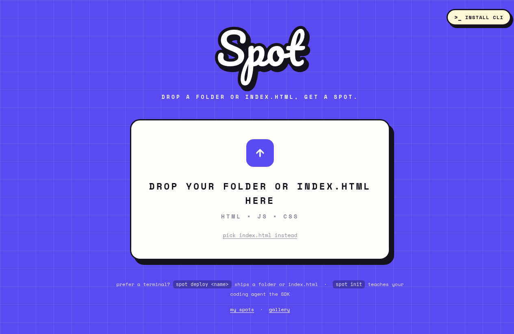

# Spot

Drop a folder, get a spot.



Spot is a self-hosted internal hosting platform for small web things
that should be easy to ship and private by default. Put it on a VM
inside your WireGuard mesh, drop a folder of HTML from the browser or
CLI, and get a private URL like `https://demo.spot.example.com`.

It is inspired by [Shopify's Quick](https://shopify.engineering/quick):
no frameworks, no pipelines, no per-site config. A site can be a single
`index.html`, a folder of HTML/CSS/JS, or a small app that uses Spot's
built-in document DB, realtime rooms, files, and AI proxy.

## Use Cases

- **Corporate internal apps**: ship dashboards, demos, status pages,
  design prototypes, team tools, and one-off workflows without opening
  them to the internet. Identity comes from NetBird or Tailscale, so the
  same mesh that decides who can reach Spot also powers per-site access
  rules.
- **Homelabs and family networks**: host household tools, experiments,
  notes, dashboards, and a low-friction playground where kids can publish
  HTML/CSS/JS projects to the family Tailnet without learning deploy
  keys, DNS, or cloud accounts first.

## How It Works

```
employee device (mesh peer: NetBird or Tailscale)
        │  WireGuard mesh — provider policy decides who reaches the VM
        ▼
spot VM (mesh peer)
  ├─ Caddy        wildcard *.spot.<domain>: site files + /api + /spot.js
  ├─ spot-api    Go: document DB, identity from mesh peer IPs
  ├─ Postgres     JSONB document store
  ├─ RustFS       S3 buckets spot-sites / spot-uploads
  └─ rclone       FUSE-mounts spot-sites read-only for Caddy
```

Authentication is the mesh itself: only mesh peers can reach the VM,
and WireGuard source IPs are cryptographically bound to peers. Identity
(`/api/me`) is resolved by mapping the request's peer IP to its owner via
the configured provider's management API — no cookies, no OIDC redirects.

## Run it

```sh
just up        # full stack on https://*.spot.localhost:8443
just e2e       # end-to-end: deploy demo site, exercise serving + DB API
```

Deploys require a resolved identity. In production that identity comes
from NetBird or Tailscale; for local-only development without a mesh API, set
`SPOT_DEV_IDENTITY_EMAIL=you@localhost` before `just up`.

Deploy any folder with an `index.html`, or a single `index.html` file:

```sh
cli/spot deploy mysite     # -> https://mysite.spot.localhost:8443/
cli/spot deploy mysite index.html
```

The CLI targets `SPOT_URL` (default `https://spot.localhost:8443`); set
it to a deployment's apex — e.g. `https://spot.corp.example.com` — or
persist it in `~/.config/spot/env`.

Or skip the terminal: the apex page (`https://spot.localhost:8443/`) is
a deployer — drop a folder or `index.html` on it, pick a name, hit
Launch. CLI and page both post the files to `POST /api/deploy` on the
apex, which syncs them into the `spot-sites` bucket (stale files are
removed, like `rclone sync`). Going through the server means deployers
never hold storage credentials, and the endpoint only answers on the
apex host, so a deployed site's JavaScript can never redeploy other sites
with a visitor's browser.

`cli/spot init` writes an agent skill for Claude Code, Codex, or Pi,
either into the current project or the user's global agent skills
directory, so coding agents know the SDK without reading docs.

## Deploy with Docker Compose

Spot is meant to run on a small VM that is already joined to your
NetBird or Tailscale network. The mesh decides who can reach the VM;
Spot uses the provider API to turn the visitor's mesh IP into an
identity.

On the VM:

```sh
git clone https://github.com/melonamin/spot.git
cd spot
cp .env.example .env
```

Edit `.env`:

- Set `SPOT_MESH_DOMAIN` to the apex you want, for example
  `spot.corp.example.com` or `spot.home.arpa`.
- Set `SPOT_SITE_LABEL` to the number of labels in that domain:
  `spot.test` is `2`, `spot.t1a.dev` is `3`,
  `spot.corp.example.com` is `4`.
- Replace `POSTGRES_PASSWORD`, `RUSTFS_ACCESS_KEY`, and
  `RUSTFS_SECRET_KEY`; shared deployments refuse the local defaults.
- Configure exactly one identity provider:
  `NETBIRD_API_URL`/`NETBIRD_API_TOKEN`, or Tailscale OAuth
  `TAILSCALE_OAUTH_CLIENT_ID`/`TAILSCALE_OAUTH_CLIENT_SECRET`.
- Optional: set `SPOT_ADMIN_EMAILS` or `SPOT_ADMIN_GROUPS` for people
  who can redeploy/delete any site.

Point DNS at the VM's mesh IP:

```text
spot.example.com      A/AAAA  <vm mesh ip>
*.spot.example.com    A/AAAA  <vm mesh ip>
```

Then start the mesh deployment:

```sh
docker compose -f docker-compose.yml -f docker-compose.mesh.yml up -d --build
docker compose -f docker-compose.yml -f docker-compose.mesh.yml ps
```

The mesh overlay runs Caddy on the host network so it can preserve the
real peer source IP for identity. It serves HTTPS on `:443`; with the
default `SPOT_TLS_MODE=tls-internal`, clients need to trust Caddy's local
CA or accept the certificate warning. For public certificates, set
`SPOT_TLS_MODE=tls-cloudflare` and `CF_API_TOKEN` for DNS-01 wildcard
certificates.

For redeploying this repository to a VM over SSH, `scripts/deploy-prod.sh`
archives the committed tree and runs the same compose command remotely.

## Tests

```sh
just test               # unit
just test-integration   # against the compose PostgreSQL (needs `just up`)
just e2e                # full stack through Caddy
```

## SDK

Sites load `/spot.js` from their own origin (Caddy serves it on every
host, and routes `/api/*` to the shared backend — same-origin, no CORS):

```js
const me = await spot.me();                      // { email, name, peer_name, peer_ip, groups }
const posts = spot.db.collection('posts');
await posts.create({ title: 'Hello Spot DB' });
await posts.list();
```

Collections are private to their site, with one exception: collections
named `shared-*` live in a single global namespace that every site can
read and write — that's how cross-site libraries (leaderboards,
comments, analytics) share data. The prefix makes sharing an explicit,
visible choice.

Realtime: any collection can be subscribed to, and every visitor sees
changes live. Under the hood each write fires `pg_notify` in its own
transaction; a dedicated listener connection relays events to a hub
that fans out to websocket sessions (`/api/ws`):

```js
const unsubscribe = posts.subscribe({
  onCreate: (doc) => ...,
  onUpdate: (doc) => ...,
  onDelete: (id) => ...,
});
```

For transient multiplayer/control-panel traffic, use ephemeral realtime
rooms. Room messages are not stored and are broadcast to the other
subscribers in the room; presence snapshots update when visitors join,
leave, or call `setPresence`:

```js
const room = spot.realtime.room('control');
room.on('cursor', ({ from, data }) => drawCursor(from.email, data));
room.onPresence((users) => renderOnline(users));
room.setPresence({ role: 'operator' });
room.send('cursor', { x: 12, y: 8 });
```

Rooms are private to their site, with the same exception as collections:
`shared-*` rooms live in a single global namespace across Spot sites.

A consequence of the same-origin routing: sites cannot serve their own
files under `/api/` or at `/spot.js`.

## Source Downloads

Every site gets a source archive at `/api/download` on its own origin:

```text
https://demo.spot.example.com/api/download
```

The archive contains the deployed files as a ZIP. Download access follows
the same rules as viewing the site: public sites are downloadable by
anyone on the mesh, restricted sites are downloadable only by allowed
visitors, and broken policies fail closed.

Sites can opt out without becoming private:

```json
{ "download": false }
```

## Access Control

Sites are **open to everyone on the mesh by default**. A site restricts
itself by shipping an `_access.json` at its root:

```json
{ "allow": ["alice@corp.com", "team-payments"] }
```

Entries containing `@` match the visitor's email; everything else
matches a mesh group name (a NetBird group or Tailscale ACL group).
Caddy consults `spot-api` (`forward_auth` → `/api/authz`)
on every request, and the backend applies the same check before serving
site APIs or uploads. Restricted sites **fail closed**: an unparseable
policy or an unreachable identity resolver denies access rather than
allowing it.

Deploys have a separate integrity rule: the first deploy of a site
claims it for that identity. Later deploys, including changes to
`_access.json`, are allowed only for the site owner or platform admins
configured with `SPOT_ADMIN_EMAILS` / `SPOT_ADMIN_GROUPS`. Every deploy
attempt is recorded in `site_deploy_audit`.

One consequence to be aware of:

- `_access.json` is an allowlist, not a secret; permitted visitors can
  fetch it like any other file of the site.
- `_access.json` may also set `"download": false` to disable the site's
  source ZIP while leaving normal page access unchanged. If `allow` is
  omitted, the site remains public; if `allow` is present as an empty
  list, the site denies everyone.

## Site pages

The apex serves two platform pages next to the deploy UI:

- **`/spots`** — the deployer's own sites, with size, access status, and
  download and delete actions.
- **`/gallery`** — every public (unrestricted) site on the mesh.

Both are backed by apex-only endpoints, gated like `/api/deploy` so a
deployed site cannot enumerate or delete sites through a visitor:

- `GET /api/sites/mine` — sites owned by the caller, with the last
  successful deploy's file count and size.
- `GET /api/sites/public` — unrestricted sites; restricted ones stay out
  entirely.
- `GET https://<site>.<domain>/api/download` — ZIP archive of that site's
  deployed files, unless `_access.json` sets `"download": false`.
- `DELETE /api/sites/{name}` — owner or platform admin only. Removes the
  served files, the site's uploads, its private collections, and the
  registry claim (so the name is free again); the action is recorded in
  `site_deploy_audit`. Shared `shared-*` collections are not touched.

## Production notes

- **DNS**: publish `*.spot.<domain>` as an A record pointing at the VM's
  mesh IP. Off-mesh clients can resolve it but cannot route to it.
- **Source IP must be the peer IP** — identity resolves the request's
  source address against the mesh peer list, so the front proxy has to
  see the real mesh IP. Docker bridge port-publishing SNATs every inbound
  connection to the docker gateway, which would make every visitor look
  like one non-peer address and break identity. Run Caddy on the host
  network: `docker compose -f docker-compose.yml -f docker-compose.mesh.yml up -d`
  (see `docker-compose.mesh.yml`). Without this, `/api/me` returns
  404 for everyone.
- **TLS**: replace `tls internal` in `caddy/Caddyfile` with a DNS-01
  wildcard challenge (e.g. the caddy-dns/cloudflare module) for publicly
  trusted certs. Also bump the `{labels.N}` index to match your domain's
  label count (see the comment in the Caddyfile).
- **NetBird**: create an access policy `employees -> spot-vm:443`, and a
  service-account PAT for `NETBIRD_API_URL`/`NETBIRD_API_TOKEN` so the
  API can resolve peer IPs to users.
- **Tailscale**: create an ACL or grant that lets employees reach
  `spot-vm:443`. Configure an OAuth client with
  `devices:core:read`, `devices:posture_attributes:read`,
  `users:read`, and `policy_file:read` scopes, then set
  `TAILSCALE_OAUTH_CLIENT_ID`/`TAILSCALE_OAUTH_CLIENT_SECRET`
  (preferred) or `TAILSCALE_API_TOKEN`. `TAILSCALE_TAILNET` may stay
  empty to use `-`, the token's tailnet. `policy_file:read` is needed so
  Spot can expose Tailscale ACL groups in `_access.json`.
- `spot-api` refuses to start on a
  non-`.localhost` domain without one mesh identity provider, and
  `SPOT_DEV_IDENTITY_EMAIL` is only accepted for `.localhost` development.
- **Trusted proxies**: `spot-api` only trusts `X-Forwarded-*` headers
  from `SPOT_TRUSTED_PROXIES`. The local compose stack pins its Docker
  network and trusts only loopback plus that subnet; the mesh overlay
  narrows this to loopback plus the pinned Docker gateway `/32`.
- **Credentials**: local `.localhost` development may use the example
  RustFS/Postgres passwords. Shared or mesh-backed deployments must
  replace them or `spot-api` refuses to start.
- **RustFS** is beta (v1.0.0-beta.8, single-node). Sites are regenerable,
  so the blast radius is low; Garage or SeaweedFS are drop-in S3
  alternatives if that bothers you.

## Files and AI

Uploads go through the server (browsers never see storage credentials)
into the `spot-uploads` bucket; download URLs are immutable and may be
embedded from any site. If the upload belongs to a restricted site, the
download is restricted by that site's `_access.json` too:

```js
const stored = await spot.files.upload(file);  // { id, name, size, content_type, url }
```

The content type is sniffed from the bytes, not the client's claim.
Images, PDFs, plain text, and audio/video render inline; everything else
(HTML, SVG, unknown) is served as a sandboxed `attachment` with
`nosniff` so an uploaded file can't run script in a viewer's site origin.
For stricter isolation in production, serve `/api/files` from a separate
cookieless domain.

The AI proxy holds the Anthropic key server-side (`ANTHROPIC_API_KEY`
in `.env`). By default only the site owner or platform admins may call
it, so a public mesh site cannot spend the shared key for every visitor.
Set `SPOT_AI_ACCESS=visitors` to allow all authorized visitors globally,
or opt a restricted site in with:

```json
{ "allow": ["team-payments"], "ai": "visitors" }
```

Set `ANTHROPIC_BASE_URL` to route the proxy through an
Anthropic-compatible gateway instead of the Claude API. Defaults:
`claude-opus-4-8` (deployment-overridable with `SPOT_AI_MODEL`, e.g.
when the gateway serves a different model list), adaptive thinking,
16K max tokens. Requests may set `system` and `max_tokens`; `model` is
accepted only when named in `SPOT_AI_ALLOWED_MODELS` or when it matches
the deployment default:

```js
const res = await spot.ai.chat([{ role: 'user', content: 'Summarize my tasks' }]);
console.log(res.text);
```

## Rate limits

Per peer IP: database 25 req/s (burst 50), realtime room sends 30 req/s
(burst 60), uploads 2 req/s (burst 10), AI 1 request per 2s (burst 10),
deploys 1 per 2s (burst 3). The authz endpoint Caddy consults for
static files is deliberately unlimited.

Compared to the blog's feature list, only the data warehouse
(Shopify-specific BigQuery) is deliberately omitted — wire your own
warehouse in if one exists.
