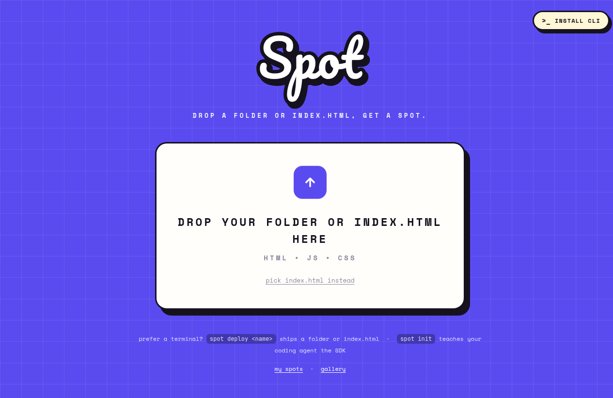

# Spot

Drop a folder, get a spot.



Spot is a self-hosted internal hosting platform for small web things that
should be easy to ship and private by default. Put it on a VM inside your
NetBird or Tailscale mesh, drop a folder of HTML from the browser or CLI,
and get a private URL like `http://demo.spot.example.com`.

For trusted homelabs, Spot can also run in `single-user` mode: no provider
API, no per-person identity, just one fixed owner for everyone who can
reach the box.

## How It Works

```text
mesh peer
   |
   | WireGuard mesh decides who can reach the VM
   v
spot VM
  |- spot-api   Go binary: platform UI, deployed sites, APIs, realtime
  |- SQLite     metadata, documents, deploy registry, audit log
  `- S3/RustFS  deployed site files and uploads
```

Authentication is normally the mesh itself. NetBird or Tailscale decides who
can reach the VM, and Spot maps the request's mesh source IP to an identity
through the provider API. There are no cookies, sessions, or OIDC redirects.
For trusted repository automation outside the mesh, an owner can create a
named, fixed-prefix publishing key that authenticates only `POST /api/deploy`.

S3-compatible storage stays in the architecture because deployed sites
and uploads can be large and are the easiest part to keep in blob storage.
SQLite is the only metadata database.

## Quick Start

```sh
cp .env.example .env
just up
```

The local compose stack runs:

- `spot-api` on `http://spot.localhost:8080`
- RustFS on loopback for S3-compatible blob storage
- SQLite in the `spot-data` volume

Local development uses `SPOT_DEV_IDENTITY_EMAIL=dev@spot.local` by
default so deploys work without a mesh API. Shared deployments must use a
real mesh provider or `SPOT_AUTH_MODE=single-user`.

Deploy a folder with an `index.html`:

```sh
cli/spot deploy demo examples/demo
```

Then open:

```text
http://demo.spot.localhost:8080/
```

The CLI targets `SPOT_URL` and defaults to
`http://spot.localhost:8080`. Persist another deployment with:

```sh
mkdir -p ~/.config/spot
printf 'SPOT_URL=https://spot.example.com\n' > ~/.config/spot/env
```

The apex page is also a deployer: open `http://spot.localhost:8080/`,
drop a folder or `index.html`, pick a name, and launch.

## Spot Show Reports

Spot Show turns a JSON card/block document into a visual report site. Use it
for agent work logs, architecture sketches, review notes, diffs, terminal
output, structured data, diagrams, screenshots, or small sandboxed demos.

Start from a template:

```sh
cli/spot show init show.json
```

Validate the document and any local image assets:

```sh
cli/spot show validate show.json
```

Deploy it to a stable site name:

```sh
cli/spot show deploy spot-show show.json
```

Spot Show deploys capture and upload `_screenshot.png` by default so the
gallery uses a real thumbnail. For custom static sites, use
`cli/spot deploy --screenshot <name> <folder>` when the site should appear in
the public gallery with a preview.

For local demos, open the browser after deploy:

```sh
cli/spot show deploy --open spot-show show.json
```

For active iteration, watch the file and redeploy on changes:

```sh
cli/spot show watch --open spot-show show.json
```

Open the generated site at:

```text
http://spot-show.spot.localhost:8080/
```

The generated page includes `/spot-live.js`, so open tabs refresh after each
redeploy. The generated `_spot.json` uses the show's `title` and `description`
for gallery metadata.

The report viewer supports system/light/dark appearance, stable card links,
fullscreen Mermaid diagrams and images, sandboxed theme-aware HTML, copied
local image assets, syntax-highlighted code with source line numbers, ANSI
terminal output, unified or split diffs, collapsible JSON, and agent trace
timelines. Existing Show documents remain valid; the richer fields are
optional.

The full schema is served by the running Spot instance:

```sh
cli/spot show-schema
```

An example report lives in `examples/spot-show/show.json` and can be deployed
to the local stack with:

```sh
just deploy-show-demo
```

## Deployment Modes

### Prebuilt Images

Multi-architecture images (`linux/amd64` and `linux/arm64`) are published to
the GitHub Container Registry:

- `ghcr.io/melonamin/spot-api` — the Spot server.
- `ghcr.io/melonamin/spot-caddy` — Caddy with the Cloudflare DNS module, for
  `SPOT_TLS_MODE=tls-cloudflare`.

Available tags:

- `latest` — the most recent tagged release.
- `X.Y.Z` and `X.Y` — a specific release.
- `edge` — the current `main` branch.
- `sha-<commit>` — a specific commit.

The Compose files reference these images by default, so the commands below
pull a prebuilt image when you omit `--build`. Images are published starting
with the first tagged release; before a release exists, or to run unreleased
code, build from source by adding `--build`. To pin a release, set
`SPOT_API_IMAGE` (and `SPOT_CADDY_IMAGE` for the TLS overlay):

```sh
SPOT_API_IMAGE=ghcr.io/melonamin/spot-api:0.1.0 \
  docker compose -f docker-compose.yml -f docker-compose.mesh.yml up -d
```

### Mesh Identity

Use this for the normal shared deployment model.

1. Point the apex and wildcard DNS at the VM's mesh IP:

   ```text
   spot.example.com      A/AAAA  <vm mesh ip>
   *.spot.example.com    A/AAAA  <vm mesh ip>
   ```

2. Set a non-local domain and replace default RustFS credentials:

   ```env
   SPOT_MESH_DOMAIN=spot.example.com
   RUSTFS_ACCESS_KEY=...
   RUSTFS_SECRET_KEY=...
   ```

3. Configure exactly one provider:

   ```env
   NETBIRD_API_URL=https://netbird.example.com
   NETBIRD_API_TOKEN=...
   ```

   or:

   ```env
   TAILSCALE_OAUTH_CLIENT_ID=...
   TAILSCALE_OAUTH_CLIENT_SECRET=...
   TAILSCALE_TAILNET=-
   ```

4. Start with host networking for `spot-api`, so it sees the real mesh
   peer source IP:

   ```sh
   docker compose -f docker-compose.yml -f docker-compose.mesh.yml up -d --build
   ```

To let Spot serve HTTPS directly, add the TLS overlay:

```sh
docker compose \
  -f docker-compose.yml \
  -f docker-compose.mesh.yml \
  -f docker-compose.tls.yml \
  up -d --build
```

`SPOT_TLS_MODE=tls-internal` uses Caddy's internal CA.
`SPOT_TLS_MODE=tls-cloudflare` uses DNS-01 wildcard certificates and
requires `CF_API_TOKEN` with Zone:Zone:Read and Zone:DNS:Edit.

If you put another TLS proxy in front, preserve the real source IP and
add only that proxy to `SPOT_TRUSTED_PROXIES` so Spot can trust
`X-Forwarded-Proto` and `X-Forwarded-For`.

### Forward-Auth Identity (Pangolin / SSO proxy)

Use this when an authenticating reverse proxy fronts Spot and asserts who
the caller is via HTTP headers — for example
[Pangolin](https://pangolin.net), Authelia, Authentik, or a bespoke proxy
in front of agent sandboxes that deploy on a user's behalf. The proxy
handles login (SSO/OIDC); Spot reads the asserted identity in place of a
mesh peer lookup:

| Proxy header | Spot identity field | Default name |
| --- | --- | --- |
| user id | `peer_name` | `Remote-User` |
| email | `email` (ownership + `_access.json`) | `Remote-Email` |
| full name | `name` | `Remote-Name` |
| groups / role | `groups` (`_access.json`) | `Remote-Groups` |

1. Enable forward auth, overriding header names if your proxy differs:

   ```env
   SPOT_FORWARD_AUTH=1
   # Pangolin asserts a single Remote-Role:
   SPOT_FORWARD_AUTH_GROUPS_HEADER=Remote-Role
   ```

2. Trust only the proxy. Spot honors `Remote-*` solely from the immediate
   socket peer, so set this to the proxy's IP/CIDR:

   ```env
   SPOT_TRUSTED_PROXIES=10.0.0.0/24
   ```

Forward auth can run alongside a mesh provider (proxy identity wins when
its headers are present, otherwise the mesh resolves by IP) or as the only
identity source.

Notes:

- The trusted proxy MUST strip any client-supplied `Remote-*` before
  injecting its own. Spot believes whatever a trusted peer sends; the same
  headers from an untrusted socket are ignored.
- To run the proxy off-mesh (where its source IP isn't a reliable identifier),
  set `SPOT_FORWARD_AUTH_SECRET` to a long random value and have the proxy send
  it in the `X-Spot-Forward-Auth-Secret` header. When set, the secret is
  required and replaces the source-IP check.
- Pangolin only emits identity headers under SSO. PIN, password, and
  shareable links authenticate but carry no identity, so restricted sites
  behind Pangolin require SSO.
- If a TLS proxy (Caddy) sits between Pangolin and `spot-api`, that hop
  must be private to Pangolin. Do not expose a pass-through Caddy listener
  directly to clients after adding Caddy to `SPOT_TRUSTED_PROXIES`: Caddy
  forwards request headers by default, so Spot would trust spoofed
  `Remote-*` from anyone who can reach it. Make the auth proxy the public
  entrypoint, or strip and re-inject identity headers only after auth.
- Email is the principal: a user keeps the same site ownership whether they
  arrive via the proxy or the mesh, as long as the email matches.

### Single-User Homelab

Use this when LAN/VPN/firewall access is the boundary and everyone who
can reach Spot should act as the same owner:

```sh
docker compose -f docker-compose.yml -f docker-compose.homelab.yml up -d --build
```

Set `SPOT_HOMELAB_DOMAIN` if you do not want the default
`spot.home.arpa`, and publish the apex plus wildcard to the host's LAN or
VPN IP.

Keep `SPOT_SINGLE_USER_EMAIL` stable. It is the owner key used for deploy
authorization.

### Single Binary, Local Storage

This is the smallest install. It uses SQLite plus filesystem storage, no
RustFS/S3:

```sh
cd server
go build -o spot-api .

./spot-api serve \
  --storage local \
  --auth single-user \
  --domain spot.home.arpa \
  --data-dir /var/lib/spot \
  --listen :8080
```

Data lands under:

```text
/var/lib/spot/
  spot.db
  sites/<site>/...
  uploads/<site>/<id>/<name>
```

Point both DNS records at the machine:

```text
spot.home.arpa      A/AAAA  <vm lan or vpn ip>
*.spot.home.arpa    A/AAAA  <vm lan or vpn ip>
```

Open `http://spot.home.arpa:8080/` unless you put TLS in front.

### Single Binary, S3 Storage

This keeps the one-process Spot runtime while storing large files in
S3-compatible blob storage:

```sh
./spot-api serve \
  --storage s3 \
  --auth single-user \
  --domain spot.home.arpa \
  --data-dir /var/lib/spot \
  --listen :8080
```

Required environment:

```env
SPOT_S3_ENDPOINT=127.0.0.1:9000
SPOT_S3_ACCESS_KEY=...
SPOT_S3_SECRET_KEY=...
SPOT_UPLOADS_BUCKET=spot-uploads
SPOT_SITES_BUCKET=spot-sites
```

The server creates the buckets if they are missing.

## Configuration

Environment variables and CLI flags overlap for the install-critical
settings:

```text
--storage   SPOT_STORAGE_MODE      s3 or local
--auth      SPOT_AUTH_MODE         auto or single-user
--domain    SPOT_DOMAIN
--data-dir  SPOT_DATA_DIR
--sqlite    SPOT_SQLITE_PATH
--listen    PORT
```

`SPOT_STORAGE_MODE` defaults to `s3`. `SPOT_SQLITE_PATH` defaults to
`$SPOT_DATA_DIR/spot.db`.

Spot derives generated URLs from the request. Direct HTTP returns
`http://`, direct TLS returns `https://`, and trusted proxies may send
`X-Forwarded-Proto`. There is no configured public scheme.

## Production Deploy

Deploy the committed tree with the TLS overlay and orphan cleanup:

```sh
scripts/deploy-prod.sh
```

Production deploys run a gallery backfill after the containers restart. The
backfill writes missing `_spot.json` metadata and captures missing
`_screenshot.png` previews for public sites.

To populate gallery metadata for sites deployed before `_spot.json` and
screenshots existed, run the maintenance backfill from the production
environment:

```sh
spot-api backfill-gallery
spot-api backfill-gallery -write -screenshots
```

The first command is a dry run. With `-write`, Spot updates the site metadata
columns and writes missing `_spot.json` files directly to site storage. With
`-screenshots`, it captures missing `_screenshot.png` files for public sites
using headless Chromium. The command does not use `/api/deploy`, so it does not
change site owners, create deploy audit entries, or touch `updated_at`.

## SDK

Sites load `/spot.js` from their own origin:

```html
<script src="/spot.js"></script>
```

All calls are same-origin:

```js
const me = await spot.me(); // { email, name, peer_name, peer_ip, groups, ai_allowed }
const posts = spot.db.collection('posts');
const doc = await posts.create({ title: 'Hello Spot DB' });
const docs = await posts.list();
const next = await posts.list({ limit: 25, after: docs.at(-1)?.id });
const mine = await posts.list({ mine: true });
await posts.updateMine(doc.id, { title: 'Only I can edit this path' });

// Filter, sort, count, batch read, and iterate. where ops: eq ne gt gte lt lte in.
const open = await posts.list({ where: { status: 'open' }, sort: 'priority', order: 'desc' });
const total = await posts.count({ where: { status: 'open' } });
const some = await posts.getMany([doc.id, next?.[0]?.id]);
for await (const p of posts.iterate({ pageSize: 100 })) { /* every doc, paged */ }

// Atomic counter — no read-modify-write, safe under concurrency:
await posts.increment(doc.id, 'views');
```

Collections are private to their site, except `shared-*` collections,
which live in one global namespace every site can read and write.

Every document records an `owner` — the mesh identity that created it — so
several visitors can keep private records in one shared site.
`list({ mine: true })` returns only the caller's documents. Writes are not
restricted to the owner by default; use `updateMine`, `deleteMine`, or
`{ mine: true }` on mutations when only the creator should be able to change
a document. The `owner` (a lowercased email or peer IP) is included in every
read response, so on a site many visitors can read, treat it as visible to all
of them.

Realtime DB subscriptions are process-local and delivered after SQLite
commits:

```js
const unsubscribe = posts.subscribe({
  onCreate: (doc) => console.log(doc),
  onUpdate: (doc) => console.log(doc),
  onDelete: (id) => console.log(id),
}, { replay: true }); // replay current docs as onCreate first, then live changes
```

Every call rejects with a `spot.SpotError` (`status`, `code`, and `retryAfter`
on a 429). The SDK retries rate-limited and transient failures automatically
with backoff; tune it with `spot.configure({ retry })` or a per-call
`{ retry }` option.

Ephemeral realtime rooms are also process-local and are not persisted:

```js
const room = spot.realtime.room('control');
room.on('cursor', ({ from, data }) => drawCursor(from.email, data));
room.onPresence((users) => renderOnline(users));
room.onStatus((status) => renderConnection(status));
room.setPresence({ role: 'operator' });
room.send('cursor', { x: 12, y: 8 });
```

## Access Control

Sites are open to everyone who can reach Spot by default. A site controls
visitor access and delegated management by shipping `_access.json` at its root:

```json
{
  "allow": ["alice@example.com", "team-payments"],
  "maintainers": ["bob@example.com", "team-platform"]
}
```

Entries containing `@` match email. Other entries match mesh groups. A
broken policy fails closed. `allow` and `maintainers` are independent: a
maintainer can deploy, delete, and manage Cloudflare for an active site but
cannot visit a restricted site unless `allow` also matches them.

The first deploy claims a site name for an immutable original owner. Later
deploys, active-site deletes, Cloudflare operations, and owner-mode AI or Slack
may be performed by that owner, a platform admin from `SPOT_ADMIN_EMAILS` or
`SPOT_ADMIN_GROUPS`, or a current email/group maintainer. Maintainers may change
the maintainer list through a later authorized deploy, including removing
themselves.

If a maintainer deletes a site, Spot purges its content and dependent data but
keeps a recovery tombstone for the original owner. Only that owner or a
platform admin can redeploy the reserved name or release it permanently. This
prevents delegated deletion from becoming ownership transfer. `/spots` shows
active sites to every authorized manager and shows recovery tombstones only to
their owner or a platform admin.

In `single-user` mode, every visitor has the same configured identity.
Ownership still works, but `_access.json` cannot provide per-person
authorization.

Sites can disable source downloads without becoming private:

```json
{ "download": false }
```

Sites can also describe themselves for `/gallery` with `_spot.json`:

```json
{
  "title": "Sketch Pad",
  "description": "Draw quick ideas in the browser.",
  "tags": ["creative", "drawing", "tool"]
}
```

Tags are optional, normalized to lowercase chips, and searchable/filterable in
Gallery. If tags are omitted and the server AI proxy is configured, Spot may
suggest tags from the public site's title, description, headings, and filenames.
Restricted sites are not auto-tagged.

## Platform Pages

- `/` is the browser deployer.
- `/spots` lists sites the caller can manage, including delegated sites and
  owner/admin recovery tombstones.
- `/gallery` lists unrestricted public sites.

Important APIs:

- `POST /api/deploy` deploys a site from the apex only.
- `GET` and `POST /api/publishing-keys` list the caller's keys and create a
  named, fixed-prefix key. The secret is returned only by the create response.
- `DELETE /api/publishing-keys/{id}` irrevocably revokes a key. Administrators
  may revoke a known key ID, but there is no administrator-wide key listing.
- `GET /api/sites/mine` lists the caller's sites.
- `GET /api/sites/manageable` lists sites the caller can manage and includes
  `management_role`, immutable owner attribution, and lifecycle state.
- `GET /api/sites/public` lists unrestricted sites.
- `GET /api/sites/{name}/cloudflare` returns optional Cloudflare Pages
  publication status.
- `POST /api/sites/{name}/cloudflare/publish` publishes an eligible site
  to Cloudflare Pages. Its optional JSON body is `{"visibility":"public"}`
  or `{"visibility":"restricted","emails":["friend@example.com"]}`.
- `POST /api/sites/{name}/cloudflare/access/resolve` recovers an Access create
  whose network outcome is uncertain. `{"confirm_absent":true}` may clear the
  attempt only after an authorized manager has verified in Cloudflare that the
  named Spot application is absent; a matching application is adopted instead.
- `POST /api/sites/{name}/cloudflare/project/resolve` reconciles an uncertain
  Pages create after an authorized manager verifies the project as `owned`,
  `unmanaged`, or `absent` in Cloudflare.
- `POST /api/sites/{name}/cloudflare/legacy/resolve` clears an upgraded legacy
  row after `{"confirm_resources_removed":true}` confirms its external Pages,
  DNS, and Access resources were removed manually.
- `DELETE /api/sites/{name}/cloudflare` unpublishes it from Cloudflare.
- `DELETE /api/sites/{name}` purges a site's files, uploads, and private docs.
  Owner/admin deletion releases the registry claim; maintainer deletion leaves
  an owner-recoverable tombstone.
- `GET /api/download` on a site subdomain downloads a source ZIP,
  unless the site disables downloads.

On the Spot root, the SDK wraps the site APIs:

```js
const mine = await spot.sites.mine();
const manageable = await spot.sites.manageable();
const publicSites = await spot.sites.public();
await spot.sites.delete('old-demo');
```

`mine()` remains the ownership-only compatibility view. Platform management UI
and new integrations should normally use `manageable()`.

## Repository Publishing Keys

Named publishing keys let a trusted CI repository deploy pull-request sites
without giving its runner a mesh identity. Create one from **My spots** at
`/spots`, give it a descriptive name, and bind it to a literal prefix such as
`spot-pr-`. The key can create, update, or recreate sites such as
`spot-pr-184`, but it cannot deploy outside that prefix or take over a matching
site owned by someone else.

The person who creates the key remains the immutable owner of every site the
key creates. The key name is recorded as publisher attribution in deploy audit
history and authenticated `/spots` responses. It is not exposed in Gallery.
Publishing keys authenticate deploys only: they cannot delete sites, publish
to Cloudflare Pages, manage other keys, or call deployed-site APIs. Trusted
repository workflows may deploy `_access.json`, with the same validation and
policy-transition protections as an owner deploy.

The secret is displayed once. Store it as a masked repository secret named
`SPOT_PUBLISH_KEY`; do not put it in the CLI config file or command line. The
CLI sends it to curl over standard input so it is not exposed in the process
argument list. A GitHub Actions step can deploy one site per pull request:

```yaml
- name: Publish Spot preview
  env:
    SPOT_URL: https://spot.example.com
    SPOT_PUBLISH_KEY: ${{ secrets.SPOT_PUBLISH_KEY }}
  run: ./cli/spot deploy "spot-pr-${{ github.event.pull_request.number }}" dist
```

A hosted runner still needs a routable, trusted HTTPS path to the Spot apex;
the publishing key supplies application authentication, not network access.
Use one key per repository. To rotate without downtime, create a replacement
with the same prefix, update the repository secret, confirm its **Last used**
time in `/spots`, then revoke the old key. Revocation is immediate for deploys
that have not yet passed Spot's transactional authorization point.

These credentials publish into Spot itself. They are unrelated to the optional
Cloudflare Pages publishing flow below.

## Optional Cloudflare Pages Publishing

Spot can publish eligible manager-authorized sites from `/spots` to Cloudflare
Pages at:

```text
https://<site>.<SPOT_CLOUDFLARE_BASE_DOMAIN>/
```

Spot still serves the internal copy at `<site>.<SPOT_DOMAIN>`. Cloudflare
publishing is disabled unless all required `SPOT_CLOUDFLARE_*` variables
are present. A partial Cloudflare config disables the feature, logs the
missing keys, and reports `config_status: "partial"` from the status API.

Cloudflare publishing rejects sites that depend on Spot runtime behavior:
root `/spot.js`, `window.spot`, `spot.`, same-origin
`/api/` references, Pages Functions files, Workers files, `_routes.json`,
`_headers`, `_redirects`, or any file over 25 MiB.
Sites with more than 20,000 files are also rejected to stay within the
Cloudflare Pages Direct Upload limit available on every plan.

Cloudflare publication access is separate from Spot's private mesh.
`_access.json` continues to control only the internal Spot copy and is never
translated into a Cloudflare policy or uploaded to Pages. Changes to it do not
make the Cloudflare copy stale. At publish time, an authorized manager chooses
either public access or an exact email allowlist. Restricted copies use
Cloudflare Access email one-time PINs and protect the custom hostname, production
`<project>.pages.dev`, and wildcard preview hostnames.

Configure it:

1. In Cloudflare, choose the account and zone that owns
   `SPOT_CLOUDFLARE_BASE_DOMAIN`.
2. Find and record the Account ID, Zone ID, and public base domain, for
   example `pages.example.com`.
3. Create a temporary bootstrap token:
   - For an account-owned token, use Cloudflare dashboard
     `Manage Account` -> `Account API Tokens` -> `Create Token` and grant
     `Account API Tokens Write` plus
     `Access: Organizations, Identity Providers, and Groups Write` for the
     target account.
   - For a user token, use Cloudflare dashboard
     `My Profile` -> `API Tokens` -> `Create Token`, then use the
     `Create additional tokens` template. Add
     `Access: Organizations, Identity Providers, and Groups Write` for the
     target account.
   - Add a short TTL or IP restriction if practical.
   - Copy the token once; Cloudflare only shows the secret once.
4. Run the setup script locally:

   ```sh
   scripts/setup-cloudflare-pages-token.sh \
     --bootstrap-token "$CLOUDFLARE_BOOTSTRAP_TOKEN" \
     --account-id "$CLOUDFLARE_ACCOUNT_ID" \
     --zone-id "$CLOUDFLARE_ZONE_ID" \
     --base-domain pages.example.com
   ```

   The script defaults to an account-owned bootstrap token and creates an
   account-owned runtime token. It reuses an existing One-time PIN identity
   provider or creates `Spot email one-time PIN`. If the bootstrap token came
   from **My Profile** instead, add `--bootstrap-token-kind user`; the runtime
   token will then be user-owned. The generated runtime token is limited to
   Cloudflare Pages Write and Access Apps and Policies Write on the account,
   plus DNS Write on the selected zone.

5. Add the printed env vars to Spot:

   ```env
   SPOT_CLOUDFLARE_API_TOKEN=...
   SPOT_CLOUDFLARE_ACCOUNT_ID=...
   SPOT_CLOUDFLARE_ZONE_ID=...
   SPOT_CLOUDFLARE_BASE_DOMAIN=pages.example.com
   SPOT_CLOUDFLARE_PROJECT_PREFIX=spot-
   SPOT_CLOUDFLARE_ACCESS_IDP_ID=...
   ```

6. Restart Spot, open `/spots`, and use `Publish to Cloudflare` on an
   eligible site. Choose Public or Email restricted and enter up to 100 exact
   email addresses. Use `Cloudflare settings` to change visibility or the
   allowlist, and `Unpublish` before deleting the Spot site. If an Access create
   is interrupted before its result is known, `/spots` retains the requested
   allowlist and offers `Resolve Access state`: first check Zero Trust -> Access
   -> Applications for the displayed `Spot: <site>` application, then confirm
   it is absent. Spot checks the API again before making the publish retryable.
   Similar recovery actions appear when Pages project ownership is uncertain or
   an upgraded publication lacks the account and zone metadata needed for safe
   automatic cleanup.

Cloudflare tokens cannot precisely enforce "only new subdomains under this
base domain". Spot enforces the project prefix, project ownership metadata,
hostname shape, DNS conflict checks, and delete blocking server-side. The
existing `CF_API_TOKEN` remains only for Caddy DNS-01 TLS; it is not used by
Spot's Cloudflare Pages publisher.

Cloudflare references: [create API tokens](https://developers.cloudflare.com/fundamentals/api/get-started/create-token/),
[create tokens via API](https://developers.cloudflare.com/fundamentals/api/how-to/create-via-api/),
[account-owned tokens](https://developers.cloudflare.com/fundamentals/api/get-started/account-owned-tokens/),
[Pages REST API](https://developers.cloudflare.com/pages/configuration/api/),
[Access applications](https://developers.cloudflare.com/api/resources/zero_trust/subresources/access/subresources/applications/methods/create/),
and [one-time PIN login](https://developers.cloudflare.com/cloudflare-one/integrations/identity-providers/one-time-pin/).

## Files, Text AI, Image Generation, and Slack

Uploads go through Spot, so browsers never see storage credentials:

```js
const stored = await spot.files.upload(file);
const files = await spot.files.list();
await spot.files.delete(stored);
```

Images, PDFs, plain text, audio, and video render inline. HTML, SVG, and
unknown types download as attachments with `nosniff`.

The AI proxy holds the OpenAI-compatible gateway key server-side. For LiteLLM,
use the LiteLLM virtual key and proxy URL:

```env
OPENAI_API_KEY=...
OPENAI_BASE_URL=http://litellm:4000
SPOT_AI_MODEL=...
SPOT_AI_IMAGE_MODEL=gemini-3.1-flash-image-preview
```

```js
const chat = await spot.ai.chat([{ role: 'user', content: 'Summarize my tasks' }]);

// Stream tokens as they arrive:
await spot.ai.stream([{ role: 'user', content: 'Write a haiku' }], {
  onToken: (delta, text) => render(text),
});

const art = await spot.ai.image('A tiny cyberpunk greenhouse at night');
const img = new Image();
img.src = art.images[0].data_url;
document.body.append(img);
```

Text generation goes through `/v1/chat/completions`; image generation goes
through `/v1/images/generations`. Image responses include browser-ready
`images[0].data_url` plus `b64`, `mime_type`, and `model`. Set
`SPOT_AI_IMAGE_MODEL` to choose the deployment default, or pass a model such
as `{ model: 'gpt-image-2' }` or the LiteLLM Nano Banana 2 alias exposed by
your gateway.

By default only site managers (owner, platform admin, or `_access.json`
maintainer) may call it after passing normal visitor access. Set
`SPOT_AI_ACCESS=visitors` globally, or opt in a restricted site:

```json
{ "allow": ["team-payments"], "ai": "visitors" }
```

The Slack proxy holds a single workspace bot token server-side and lets sites
post notifications without exposing that token:

```env
SLACK_BOT_TOKEN=xoxb-...
SPOT_SLACK_ACCESS=owners
```

```js
await spot.slack.send({
  channel: '#signups',
  text: '*New signup* from the guestbook',
});
```

Set `SLACK_BASE_URL` only when routing to a compatible test or proxy upstream.
By default only site managers (owner, platform admin, or `_access.json`
maintainer) may send Slack messages after passing normal visitor access. Set
`SPOT_SLACK_ACCESS=visitors` globally, or opt in a restricted site:

```json
{ "allow": ["team-payments"], "slack": "visitors" }
```

`spot.slack.send` passes Slack mrkdwn and `blocks` through unchanged. External
public image URLs in blocks work; Spot file URLs are private to the mesh and
cannot be fetched by Slack's servers.

## Tests

```sh
just test
just test-integration
just e2e
```

`just test` runs Go vet/unit tests plus the CLI smoke test. `just e2e` starts
compose, deploys the demo site, exercises static
serving, DB APIs, uploads, site deletion, and platform pages.

Cloudflare publishing also has an opt-in live contract test. Use a dedicated
test zone/token because this creates and then removes a real Pages project,
custom domain, and DNS record:

```sh
SPOT_CLOUDFLARE_API_TOKEN=... \
SPOT_CLOUDFLARE_ACCOUNT_ID=... \
SPOT_CLOUDFLARE_ZONE_ID=... \
SPOT_CLOUDFLARE_BASE_DOMAIN=spot-tests.example.com \
just test-cloudflare-live
```

To exercise the full Access lifecycle, also provide the OTP identity provider
ID and a dedicated recipient address. The test verifies that the custom,
production, and preview hostnames challenge through Access, then transitions
the same publication back to public before cleanup:

```sh
SPOT_CLOUDFLARE_ACCESS_IDP_ID=... \
SPOT_CLOUDFLARE_LIVE_TEST_EMAIL=you@example.com \
just test-cloudflare-live
```

Normal unit, integration, and e2e targets never run this test.

## Production Notes

- Mesh identity depends on the real peer IP. Run Spot directly on the
  host network or behind a proxy that preserves source IP correctly.
- Shared deployments must configure exactly one mesh provider unless
  `SPOT_AUTH_MODE=single-user` is set.
- `SPOT_DEV_IDENTITY_EMAIL` is accepted only for `.localhost`.
- Shared mesh deployments must replace default RustFS credentials.
- RustFS is convenient for local and small deployments. Any
  S3-compatible store can replace it.
- Multi-process Spot against one SQLite file is intentionally not the
  target. If that becomes necessary, add a SQLite pub/sub layer and
  explicit leader/runtime coordination then.
